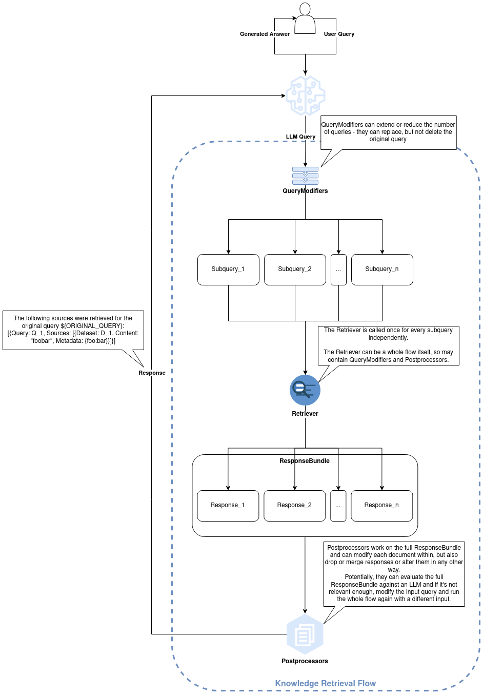

# Knowledge API

Standalone Knowledge Tool to be used with GPTScript and GPTStudio

## Build

Requires Go 1.22+

```bash
make build
```

## Run

The knowledge tool can run in two modes: server and client, where client can be standalone or referring to a remote server.

You can find a full gptscript-generated documentation in the [CLI documentation](./docs/cli.md).


### Client - Standalone

```bash
knowledge create-dataset foobar
knowledge ingest -d foobar README.md
knowledge retrieve -d foobar "Which filetypes are supported?"
knowledge delete-dataset foobar
```

### Server & Client - Server Mode

```bash
knowledge server
```

```bash
export KNOW_SERVER_URL=http://localhost:8000/v1
knowledge create-dataset foobar
knowledge ingest -d foobar README.md
knowledge retrieve -d foobar "Which filetypes are supported?"
knowledge delete-dataset foobar
```

## Supported File Types

- `.pdf`
- `.html`
- `.md`
- `.txt`
- `.docx`
- `.odt`
- `.rtf`
- `.csv`
- `.ipynb`
- `.json`

## OpenAPI / Swagger

The API is documented using OpenAPI 2.0 (Swagger), automatically generated using [`swaggo/swag`](https://github.com/swaggo/swag) (`make openapi`).

## GPTScript Examples

Note: The examples in the `examples/` directory expect the `knowledge` binary to be in your `$PATH`.

### Run

```bash
gptscript examples/client.gpt
```

## Architecture & Components

The knowledge tool is composed of the following components, which are all run from the same executable:

- knowledge client
  - can run in two modes:
    - standalone ([client/standalone](./pkg/client/standalone.go)): manages its own vector and knowledge database locally
    - server/remote ([client/default](./pkg/client/default.go)): interacts with a knowledge server over the network
- knowledge server ([server](./pkg/server))
  - lets you run a REST API server that interacts with the below databases, so the client is stateless and sends/receives data over the network
- datastore ([datastore](./pkg/datastore/datastore.go))
  - responsible for handling data ingestion and retrieval
    - ingestion includes
      - loading documents (extracting text)
      - splitting text into chunks
      - pre-processing (e.g. metadata extraction, content enrichment)
      - requesting embeddings (part of the vectorstore implementation)
      - storing embeddings and metadata in the vector database
      - registering the document in the knowledge database (index)
    - retrieval includes
      - query embedding
      - querying the vector database for embeddings - similarity search
      - mapping the retrieved embeddings to document contents
      - (optional) post-processing (e.g. filtering, sorting, summarization)
      - returning document contents alongside their similarity scores
  - consists of two databases:
    - vector database ([vectorstore](./pkg/vectorstore/vectorstores.go))
      - Current choice: [chromem-go](https://github.com/philippgille/chromem-go)
      - used for storing and retrieving embeddings alongside the document contents
      - the implementation is responsible for
        - requesting the embeddings from a model (e.g. OpenAI's text-embeddings-ada-002)
        - storing the embeddings together with metadata and document contents
        - doing similarity searches to retrieve embeddings
        - returning document contents alongside their similarity scores
    - knowledge database ([index](./pkg/index/db.go)
      - Current choice: sqlite3
      - used for
        - indexing knowledge bases (datasets): dataset <(1:n)> files <(1:n)> documents
          - this is useful for deleting specific documents or files from a dataset and to get quick overviews over datasets without having to query the vector database (which holds this information in the metadata)
        - storing knowledge base metadata and e.g. attached ingestion flows

## Retrieval Flows

The knowledge tool allows you to configure how sources are retrieved and how they should be treated before being returned to the caller (usually an LLM).

Here's how it looks like:

